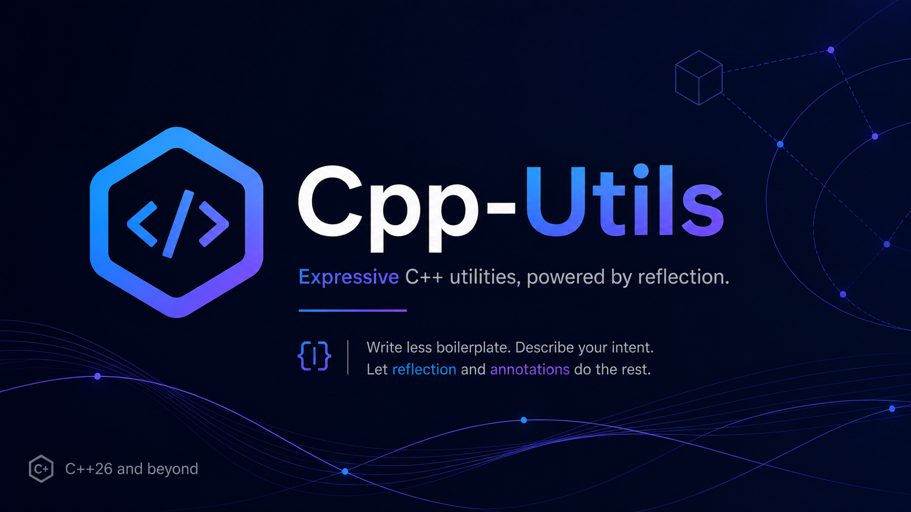

.. C++ Utils documentation master file, created by
   sphinx-quickstart on Wed May  6 21:12:19 2026.
   You can adapt this file completely to your liking, but it should at least
   contain the root `toctree` directive.

C++ Utils documentation
=======================

C++ Utils is a collection of C++26 Reflection based utilities to improve 

Add your content using ``reStructuredText`` syntax. See the
`reStructuredText <https://www.sphinx-doc.org/en/master/usage/restructuredtext/index.html>`_
documentation for details.

.. toctree::
   :maxdepth: 2
   :caption: Contents:

